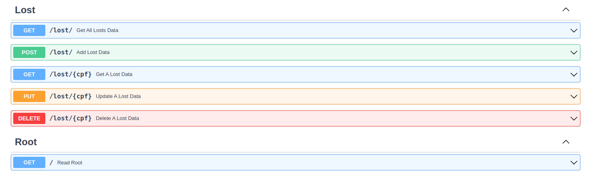

# *Lost-communication API*

## Apresentação do projeto
  
- Lost communication é um CRUID API, criada por mim como resultado de um teste técnico. A aplicação foi desenvolvida em python, utilizando o framework 
FastApi em conjunto com o MongoDB, e tem como objetivo a versão simplificada de uma comunicação de perda de um produtor rural para o programa Proagro Fácil.
    
    
## Diferenciais
  
- Além de realizar as funções de criar, ler, atualizar e deletar dados utilizando o framework FastApi, a aplicação utiliza do Atlas (um banco de dados 
    online disponibilizado pelo MongoDB). 
    
- Possui também um sistema de geolocalização, sendo capaz de identificar quando perdas são comunicadas em um 
    raio inferior a 10km.
    
- Além disso, a aplicação possui documentação gerada pelo Swagger e está deployada no Heroku.
    
 ## A api:
  
- A documentação pode ser encontrada na rota "/docs".
- Link da api deployada: https://softfocus-lc-api.herokuapp.com/
    
## Documentação:
  
  
  
## Como rodar o projeto: 
- OBS: Tenha certeza que você possui o python 3.8 instalado e o pip install, ambos são necessários para rodar o projeto. 
    - Instalando python 3.8 no ubuntu 22.04: https://pt.linuxcapable.com/how-to-install-python-3-8-on-ubuntu-22-04-lts/
    - Instalando pip install: https://pip.pypa.io/en/stable/getting-started/
  
- Clone o repositório: `git clone git@github.com:drawanz/lost-communication.git`;
- Na raiz do projeto rode o comando: `pip3 install -r requirements.txt`;
- Altere o nome do arquivo .envExample na raiz do projeto para `.env`;
- Na variável de ambiente `MONGO_DETAILS` insira a sua string de conexão com o Atlas (MongoDB);
- Na variável de ambiente `PORT` insira a porta na qual deseja rodar localmente o projeto;
- Rode o comando `python3 app/main.py`;
- Se tudo deu certo até aqui, você verá a sua aplicação rodando em: `http://0.0.0.0:*PORT*`

## Linceça

 - O presente projeto está sob a ![](app/
